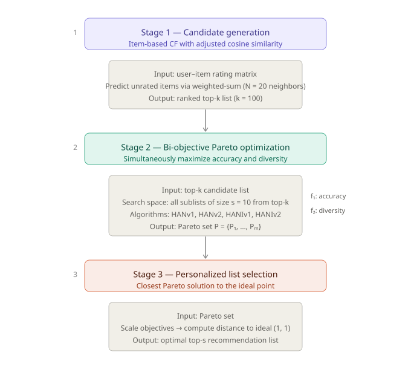

# HiMARS: Hybrid Multi-Objective Algorithms for Recommender Systems

**Paper:** Lotfian, E. & Kabgani, A. (2026). *HiMARS: Hybrid multi-objective algorithms for recommender systems.* [arXiv:2604.07572](https://arxiv.org/abs/2604.07572)

This repository provides the complete, reproducible Python implementation of all algorithms, objective functions, evaluation metrics, and experiments reported in the paper.

---

## Motivation

Recommender systems are typically optimized for accuracy alone — returning items most similar to what a user has liked before. This creates two well-known failure modes: the **long-tail problem**, where popular items crowd out niche ones, and **filter bubbles**, where users receive increasingly homogeneous content. Diversity is the natural remedy, but improving diversity almost always reduces accuracy, and vice versa.

Standard approaches collapse this conflict into a single weighted objective. This is theoretically inadequate for non-convex trade-off surfaces and practically unsatisfying because the right balance varies per user. **HiMARS reframes the problem as genuine bi-objective optimization**, computing a Pareto set of recommendation lists and selecting the optimal balance for each individual user at query time.

---

## The bi-objective problem

For a target user *u* and a recommendation list *R* of size *s*, HiMARS simultaneously maximizes:

**Accuracy** — average cosine similarity between recommended items and items the user has rated:

$$f_1(R) = \frac{\sum_{i \in R,\, j \in P_u} S(i, j)}{|R|}$$

**Diversity** — average pairwise dissimilarity within the recommended list:

$$f_2(R) = \frac{\sum_{i \in R} \sum_{j \in R,\, i \neq j} (1 - S(i,j))}{|R| \cdot (|R|-1)}$$

where $S(i, j)$ is the cosine similarity between the rating vectors of items $i$ and $j$, and $P_u$ is the set of items rated by user $u$ in training. High accuracy requires similar items; high diversity requires dissimilar ones — the objectives are structurally in conflict.

---

## Three-stage framework




---

## Algorithms

### Baselines

| Algorithm | Description |
|-----------|-------------|
| `ICF` | Item-based collaborative filtering — pure accuracy baseline, no Pareto optimization |
| `NNIA` | Non-dominated Neighbor Immune Algorithm. Immune-inspired: clones underrepresented Pareto points to improve population diversity |
| `NSGA-II` | Non-dominated Sorting Genetic Algorithm II. Effective global exploration via fast non-dominated sorting and crowding distance |
| `AMOSA` | Archived Multi-Objective Simulated Annealing. Strong local exploitation: accepts dominated solutions with probability controlled by temperature τ and domination amount |

### Proposed hybrid algorithms

| Algorithm | Components | Design principle |
|-----------|-----------|-----------------|
| **HANv1** | AMOSA + NSGA-II | NSGA-II runs crossover and mutation each iteration; the first Pareto front of the resulting population seeds a fresh AMOSA archive. No preprocessing. |
| **HANv2** | AMOSA + NSGA-II | AMOSA archive evolves independently via neighborhood search; NSGA-II crossover/mutation offspring are merged into the population each iteration. Requires archive initialization (via NNIA warm-start). |
| **HANIv1** | AMOSA + NNIA | Replaces NSGA-II crossover/mutation in HANv1 with NNIA cloning and immune-inspired crossover |
| **HANIv2** | AMOSA + NNIA | Replaces NSGA-II crossover/mutation in HANv2 with NNIA cloning and immune-inspired crossover |

The core insight: NSGA-II generates a broad Pareto frontier but AMOSA can partially dominate it through local refinement. The hybrids exploit both effects — NSGA-II/NNIA for global diversity, AMOSA neighborhood search for local quality — producing frontiers that are simultaneously wider and better distributed than either baseline alone.

---

## Evaluation

### Recommendation quality metrics (on the selected top-*s* list)

| Metric | Formula | Direction |
|--------|---------|-----------|
| **Accuracy** `P(R)` | `\|R ∩ T\| / \|R\|`, where T = test items with rating ≥ 3 | higher is better |
| **Diversity** `D(R)` | mean pairwise item similarity within R | lower is better |
| **Novelty** `N(R)` | mean number of users who have rated each item | lower is better |

### Pareto frontier quality metrics (on the full Pareto set)

| Metric | Measures | Direction |
|--------|---------|-----------|
| **SM** (Spacing Metric) | Uniformity of solution distribution along the frontier — mean consecutive distance after sorting by f₁ | lower is better |
| **MID** (Mean Ideal Distance) | Average distance from each normalized Pareto solution to the ideal point (1,1) | lower is better |
| **DM** (Diversification Metric) | Extent of the frontier — Euclidean distance between extreme objective values | higher is better |
| **SNS** (Spread of Non-Dominated Solutions) | Variance of solution spread on the normalized frontier | higher is better |

### Algorithm ranking — TOPSIS with AHP weights

Because SM, MID, DM, and SNS are not equally important and have different sensitivities to the number of Pareto solutions, algorithms are ranked using TOPSIS. AHP-derived weights prioritize uniformity and spread: `w_SM = w_SNS = 0.33`, `w_MID = w_DM = 0.17`. The resulting **CLO score** (relative closeness to the ideal solution) gives a single ranking per user — the algorithm with the highest CLO is considered best.

---

## Results summary

Experiments on **MovieLens-1M** (6,040 users, 3,706 movies, sparsity 82.1%) and **ModCloth** (44,784 users, 1,020 items, sparsity 99.3%), with 20 simulations, top-*k* = 100, top-*s* = 10, 200 iterations, users 3411–3420 (MovieLens) and 620–629 (ModCloth).

| Finding | Detail |
|---------|--------|
| **HANv2 ranked first overall** | Highest CLO score on both datasets across all evaluated users. Generates more uniform, better-distributed Pareto frontiers than all baselines and other hybrids. |
| **HANv2 dominates AMOSA's frontier** | And extends beyond NSGA-II's frontier — combining local exploitation with global exploration. |
| **HANv1 — best robustness** | Highest minimum accuracy and novelty values across users; most consistent floor on recommendation quality. |
| **HANIv2 — best novelty** | Smallest mean novelty values on both datasets; strongest at surfacing long-tail items. |
| **ICF — highest raw accuracy** | Expected: pure accuracy optimization outperforms Pareto methods on precision@s, but at the cost of diversity. |
| **Sparse data (ModCloth)** | HANv2 showed the greatest robustness to extreme sparsity (99.3%), suggesting the AMOSA component's local search is effective when interactions are scarce. |

---

## Repository structure

```
HiMARS/
├── src/himars/
│   ├── algorithms/
│   │   ├── amosa.py        # AMOSA + Nlists neighborhood search (Algorithms 3–4)
│   │   ├── nsga2.py        # NSGA-II crossover and mutation operators
│   │   ├── nnia.py         # NNIA cloning, crowding-distance selection, crossover
│   │   ├── han.py          # HANv1 (Algorithm 1) and HANv2 (Algorithm 2)
│   │   ├── hani.py         # HANIv1 (Algorithm 5) and HANIv2 (Algorithm 6)
│   │   └── common.py       # Shared crossover, mutation, RNG utilities
│   ├── recommender.py      # ItemBasedCF: adjusted cosine similarity, weighted-sum prediction, top-k generation
│   ├── objectives.py       # f₁ (accuracy) and f₂ (diversity) objective functions
│   ├── pareto.py           # Pareto dominance, non-dominated sorting, crowding distance, archive management
│   ├── metrics.py          # SM, MID, DM, SNS; recommendation quality (accuracy, diversity, novelty); TOPSIS/CLO
│   ├── selection.py        # Ideal-point-based list selection (Stage 3); TOPSIS ranking
│   ├── experiment.py       # Full experimental pipeline — data split, all algorithms, all metrics
│   ├── data.py             # Dataset loading for MovieLens and ModCloth
│   ├── problem.py          # RecommendationProblem and Solution data structures
│   └── config.py           # HiMARSConfig: all algorithm hyperparameters in one place
├── experiments/
│   ├── run_experiment.py   # CLI runner — accepts --config, --output-dir, --n-simulations, --max-iter
│   └── aggregate_results.py
├── configs/
│   ├── movielens.yaml      # Paper settings: users 3411–3420, 20 simulations, 200 iterations
│   └── modcloth.yaml       # Paper settings: users 620–629, 20 simulations, 200 iterations
├── tests/
│   └── test_core.py        # Smoke tests for objectives, Pareto sorting, TOPSIS, Stage 3 selection
├── pyproject.toml
├── requirements.txt
└── LICENSE
```

---

## Installation

Requires Python ≥ 3.10.

```bash
git clone https://github.com/elotfian/HiMARS.git
cd HiMARS
python -m venv .venv
source .venv/bin/activate        # macOS / Linux
# .venv\Scripts\activate         # Windows
pip install -e .[dev]
```

Dependencies: `numpy`, `pandas`, `scikit-learn`, `scipy`, `matplotlib`, `tqdm`, `PyYAML`.

---

## Data

Datasets are not included. Place files as follows:

```
data/raw/movielens/ratings.dat        # MovieLens-1M: user::item::rating::timestamp
data/raw/modcloth/df_modcloth.csv     # columns: user_id, item_id, rating
```

- **MovieLens-1M:** [grouplens.org/datasets/movielens](http://grouplens.org/datasets/movielens)
- **ModCloth:** [cseweb.ucsd.edu/~jmcauley/datasets.html](https://cseweb.ucsd.edu/~jmcauley/datasets.html)

Both are split 80/20 (train/test) with `random_state=42`.

---

## Running experiments

```bash
# Verify the installation first
pytest

# Reproduce paper results — MovieLens
python experiments/run_experiment.py \
  --config configs/movielens.yaml \
  --output-dir results/movielens

# Reproduce paper results — ModCloth
python experiments/run_experiment.py \
  --config configs/modcloth.yaml \
  --output-dir results/modcloth

# Quick smoke run (1 simulation, 2 iterations — checks the pipeline end-to-end)
python experiments/run_experiment.py \
  --config configs/movielens.yaml \
  --output-dir results/smoke \
  --n-simulations 1 \
  --max-iter 2

# Aggregate into summary tables
python experiments/aggregate_results.py --results-dir results/movielens
```

### Output files

| File | Contents |
|------|----------|
| `solutions.csv` | All Pareto solutions per algorithm, user, and simulation |
| `selected.csv` | Stage 3 output: final top-*s* list per algorithm, user, simulation |
| `pareto_metrics.csv` | SM, MID, DM, SNS, CLO, TOPSIS rank per algorithm and user |
| `selected_summary.csv` | Mean ± std of accuracy, diversity, novelty across simulations |
| `pareto_metric_summary.csv` | Mean ± std of Pareto quality metrics across simulations |

---

## Implementation notes and corrections

This package is a clean, installable rebuild of the original notebook code. The following corrections were made relative to the submitted notebooks:

| Issue | Fix |
|-------|-----|
| Notebook used global variables throughout | Replaced with explicit `RecommendationProblem`, `HiMARSConfig`, and `ObjectiveEvaluator` classes |
| ICF used plain cosine on zero-filled ratings | Implemented **adjusted cosine similarity** as specified in the manuscript (user-mean-centered before cosine) |
| Weighted-sum prediction denominator used `sum(similarity)` | Fixed to `sum(\|similarity\|)` as in the paper's Equation (3) |
| `HANv3`/`HANv4` naming in notebooks | Renamed to `HANIv1`/`HANIv2` to match paper notation |
| `HANIv2` built crossover offspring `CT` but updated population using `Ct` without first assigning `Ct = Mutate(CT)` | Mutation step added explicitly, matching Algorithm 6 line 9 |
| No random seeds | Deterministic seeds via `numpy.random.Generator` for full reproducibility |
| Division by zero in metrics for one-point Pareto fronts | Guards added throughout `metrics.py` and `pareto.py` |

---

## Citation

```bibtex
@article{lotfian2026himars,
  title   = {{HiMARS}: Hybrid multi-objective algorithms for recommender systems},
  author  = {Lotfian, Elaheh and Kabgani, Alireza},
  journal = {arXiv preprint arXiv:2604.07572},
  year    = {2026}
}
```

---

## License

MIT — see [LICENSE](LICENSE).
